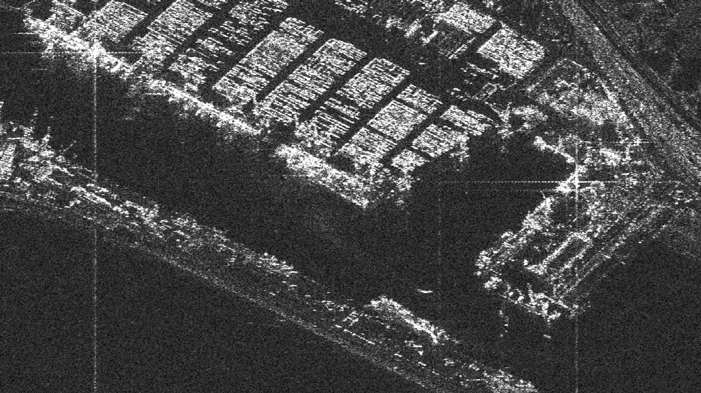
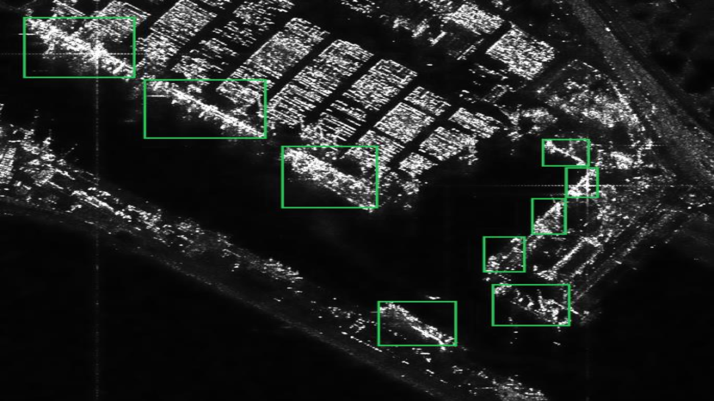
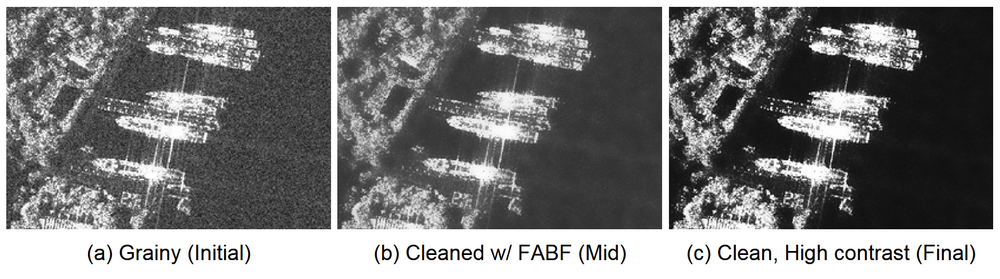
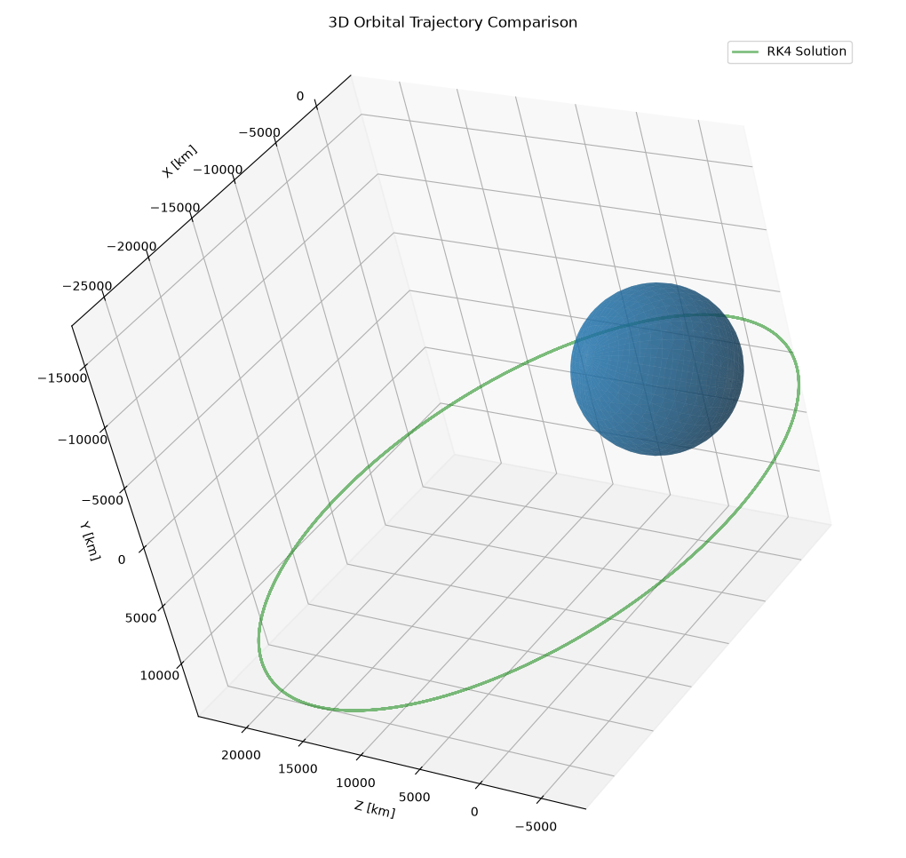
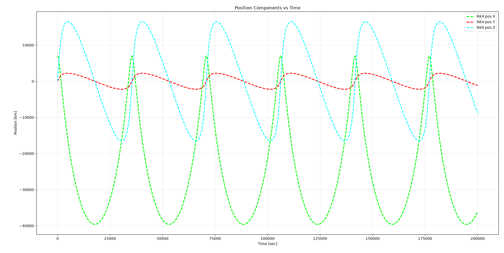
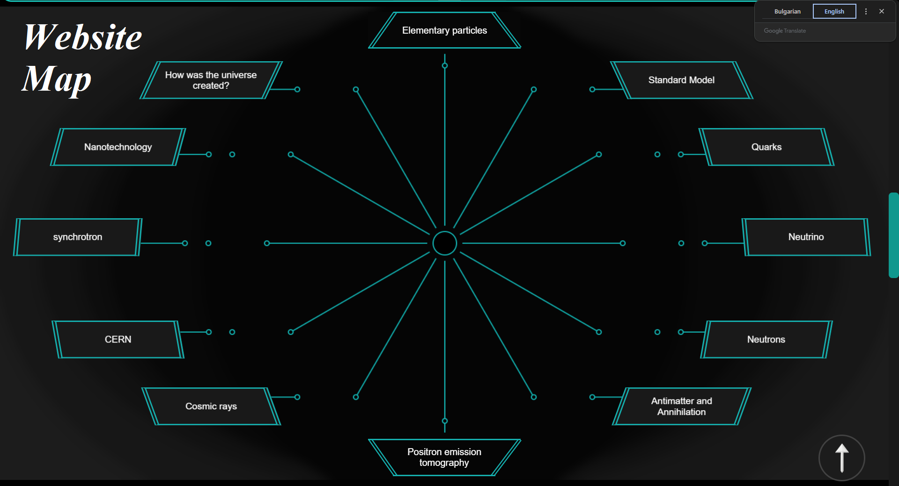
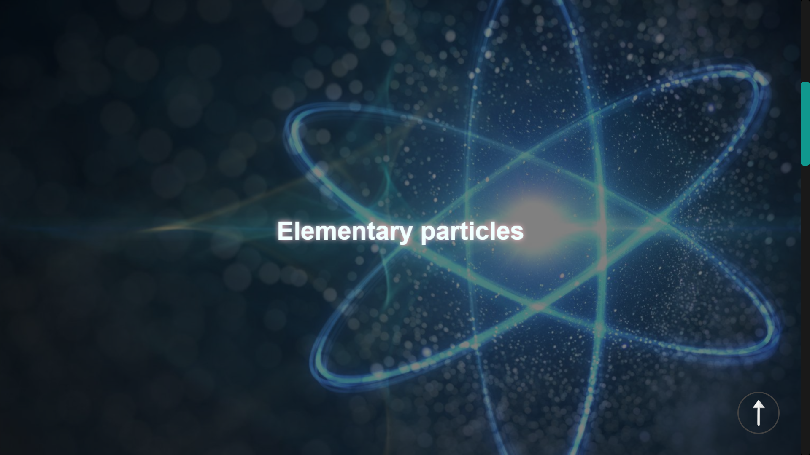

# Hi, I'm Nikola 👋

I'm interested in the intersection of **physics, simulations, and artificial intelligence**.

My background is in **physics and competitive programming**, and I've lately been getting deeper into **AI/ML and computer vision** — especially problems where mathematical and physical ideas can directly improve a practical system.

---

## 🔭 What I'm working towards

* `AI / Machine Learning` · `Physics and mathematical modelling` · `Competitive Programming` · `Scientific and technical software`

---

## 🚀 Featured Projects

<table width="100%">
<tr><td colspan="2">

### ⚓ WaveTrack.AI · SAR Ship Detection · CV

**Space Challenges 2025 · EnduroSat · Sofia, BG**
 &#8203;

</td></tr>
<tr>
<td width="50%" align="center"></td>
<td width="50%" align="center"></td>
</tr>
<tr><td colspan="2"></td></tr>
<tr>
<td width="50%" align="center">Original satelite radar image - a harbour</td>
<td width="50%" align="center">Processed image - all the ships are AI highlighted</td>
</tr>
<tr><td colspan="2">

 As part of a five-person team in the **Space Challenges 2025** program, I worked on an AI system for detecting ships in **Sentinel-1 Synthetic Aperture Radar (SAR) imagery**.

The goal was to build a lightweight pipeline suitable for eventual **on-board satellite image analysis**, given that sending entire raw images for ground processing is expensive and unnecessary. The system uses **YOLOv5n** (popular CV model) for ship detection and processes SAR imagery through a dedicated preprocessing pipeline before AI inference.

I was the team's **Image Processing** guy, responsible for the preprocessing and denoising stage - integral for increasing the model's accuracy past the initial 70%.

#### **My contribution**

I designed and implemented a **Fast Adaptive Bilateral Filtering (FABF)**-based denoising module for SAR imagery.
 &#8203;

</td></tr>
<tr><td colspan="2" align="center"></td></tr>
<tr><td colspan="2"></td></tr>
<tr><td colspan="2" align="center">Image showing the three stages of preprocessing. The original image is noticeably noisy, whereas the final image is cleaner and more suitable for CV.</td></tr>
<tr><td colspan="2">

 SAR images contain characteristic speckle noise that can obscure small structures and make ship detection more difficult, particularly near the shore. The preprocessing stage therefore needed to reduce noise **without destroying the edges and structures that the AI model relies on**. The approach adapts its smoothing using local image statistics, applying stronger smoothing to relatively uniform regions while preserving high-contrast boundaries.

The denoising stage was integrated directly into the YOLO pipeline and made configurable for both training and inference through a modular denoising interface and registry-based system.

The final preprocessing flow also included a simple **contrast enhancement**, making ship structures more distinguishable after the speckles were already dealt with.

The overall project used YOLOv5n, trained on HRSID data, with us reporting an accuracy of 97% | **70%** (open-sea | near-shore images) on the validation set before denoising and 98% | **91%** accuracy after denoising for the selected model.
 &#8203;

</td></tr><tr><td colspan="2" align="center">

**Links:**
[💻 GitHub repository](https://github.com/space-challenges-AI2/sentinel1_sar_ship_detection) ·
[⚙️ My FABF implementation](https://github.com/space-challenges-AI2/sentinel1_sar_ship_detection/blob/main/utils/denoising/fabf.py) 
[(PR)](https://github.com/space-challenges-AI2/sentinel1_sar_ship_detection/commit/286e5a2585c101881a73fff809bf86b5364e3ff1) ·
[🚀 Space Challenges](https://spaceedu.net/)
 **Tech & Skills:** `C++` · `Python` · `OpenCV` · `PyTorch` · `Image Preprocessing` · `Denoising` · `Computer Vision` · `YOLO` · `SAR`

</td></tr></table>

---

<table width="100%"><tr><td width="75%" valign="center">

### 🛰️ Orbital Propagator · RK4 & Euler Integration

Built a lightweight orbital mechanics simulator in C++, propagating a satellite's position and velocity around Earth using 4th-order Runge-Kutta integration (with Euler as a comparison method), then visualizing the trajectory in Python.

The propagator numerically integrates the two-body equations of motion from a configurable initial state (position, velocity, timestep, sample count), writing the results to CSV. A companion Python script then plots the resulting orbit in 3D against a rendered Earth, plus the individual position components over time.
 &#8203;

</td><td width="25%" valign="center" align="right">

  

  

</td></tr><tr><td colspan="2" align="center">

**Links:**
[💻 GitHub repository](https://github.com/space-challenges-AI2/HW-num-methods)
 **Tech & Skills:** `C++` · `Python` · `Matplotlib` · `Orbital Mechanics` · `Numerical Methods` · `Runge-Kutta`

</td></tr></table>

---

<table width="100%"><tr><td width="73%" valign="center">

### ⚛️ Elementary Physics

Made an educational physics website built together with a friend, **combining physics, research, and web development** in one project.

It presents accessible explanations on topics like quarks, neutrinos, and cosmic rays.

It was a project where I could connect my interest in physics with programming through an interactive website.
 &#8203;

</td><td width="27%" valign="center" align="right">

  

  

</td></tr><tr><td colspan="2" align="center">

**Links:**
[💻 GitHub repository](https://github.com/niko-dil/physics) · 
[🌐 Live website (Use Chrome!!)](https://niko-dil.github.io/physics/HTMLs/cosmic_rays.html)
 **Tech & Skills:** `HTML` · `CSS` · `JavaScript` · `Physics Research & Technical Writing`

</td></tr></table>

---

## 🧠 Background & Interests

The sections below include some of my achievements.

**Informatics:**
Competitive programming has shaped the way I approach problems: break them down, find efficient solutions, and optimize them even further.
* 🥇 · 1st place in the 🇧🇬 National Informatics Competition - Spring, 2025
* 🏅 · 4th place in the 🇧🇬 National Informatics Olympiad - 2026
* 👨‍🎓 · Participated in the 🇧🇬 Expanded National Team's training - 2026

**Physics:**
I'm particularly interested in physics and in the mathematical principles that govern our world.
* 🥉 · 3rd place in the 🇧🇬 National Physics Olympiad - 2022
* 👨‍🎓 · Endured Teodosiy's National Physics Summer Bootcamp

**AI / ML:**
I'm currently expanding into machine learning and computer vision, with a particular interest in applying them to technically challenging, real-world problems.
* 🎓 · Graduated EnduroSat's 5-week Space Challenges program with an 83.6% final score - 2025

---

## 🛠️ Tools & Technologies

`C++` · `Python` · `OpenCV` · `PyTorch` · `Git` · `HTML` · `CSS` · `Numerical Methods`

---

## 📌 Selected Work

| Project                     | Contribution          | Focus                                                   |
| --------------------------- | --------------------- | ------------------------------------------------------- |
| **WaveTrack.AI**            | Image Preprocessing   | Satelite SAR image denoising & preprocessing for AI CV  |
| **RK4 Orbital Propagator**  | C++ Numerical Methods | RK4 & Euler numerical integration for orbit propagation |
| **Elementary Physics Site** | Co-developer          | Web development & Physics popularization                |

---

### 🌱 Always learning

I mainly participate in projects where **physics and AI intersect** - particularly problems involving perception, simulation, and systems that have to work under real constraints.

---